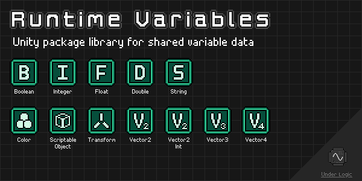

# Runtime Variables

[](https://openupm.com/packages/com.underlogic.runtime-variables/)



Unity package library for sharing variable data across components and scenes.
Uses `ScriptableObjects` to store data and exposes events for when values change.

Heavily inspired by the infamous [Unite 2017: Game Architecture with Scriptable Objects](https://www.youtube.com/watch?v=raQ3iHhE_Kk) presentation by Ryan Hipple ([GitHub](https://github.com/roboryantron/Unite2017)).

**NOTE:** This package is still in development and may have breaking changes in future versions until a stable v1.0.0 release is made.

## Installation

The package library can be installed to your Unity project in the following ways:

- Using [OpenUPM](https://openupm.com/) package manager
  - `openupm add com.underlogic.runtime-variables`
- Clone the repository and adding it as a local package
- Add the package by git URL

Installing it by git URL allows the package to be updated when new releases are available here.

## Documentation

[Online documentation](https://underlogic.github.io/runtime-variables/) is automatically published to GitHub Pages.

Offline docs can be found in the [`Documentation~`](./Documentation~) folder, and can be viewed via [`mdbook`](https://rust-lang.github.io/mdBook/index.html):

```shell
$ mdbook serve ./Documentation~ --open
```

## Samples

The package library includes several sample scenes that demonstrate how to use each type of variable component.
It is highly recommended that you import the samples so you can see the library in action and experiment with it.

## Contributing

To make working on the library easier while keeping this repository minimal, it is recommended to create a separate Unity project, (i.e. `runtime-variables-project`).

Then link the following folders into the Unity project for easy editing/syncing while keeping code completion and intellisense:

```shell
$ cd runtime-variables-project/Assets
$ ln -s ~/runtime-variables/Samples~ Samples

$ mkdir -p Scripts && cd Scripts
$ ln -s ~/runtime-variables/Editor
$ ln -s ~/runtime-variables/Runtime
$ ln -s ~/runtime-variables/Tests
```

**NOTE:** This assumes both folders are in your `$HOME` folder. Adjust paths accordingly if they differ.

Now you can work in the shell project without copying files back and forth, and also generating `.meta` files automatically.
